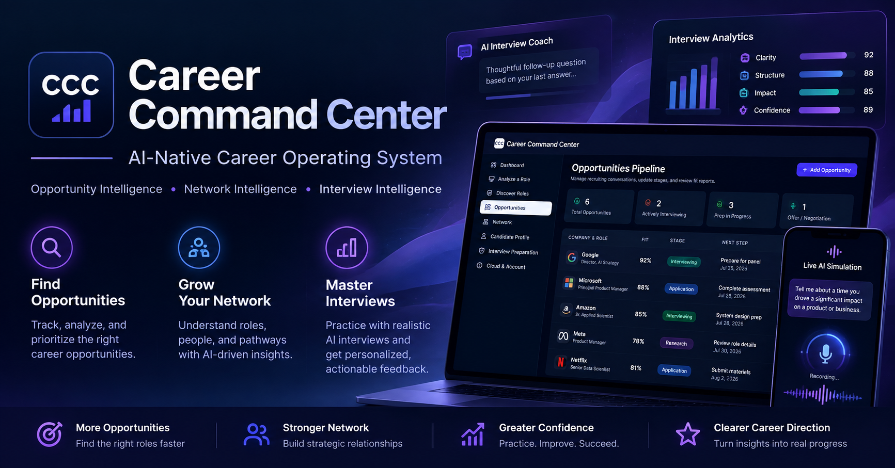
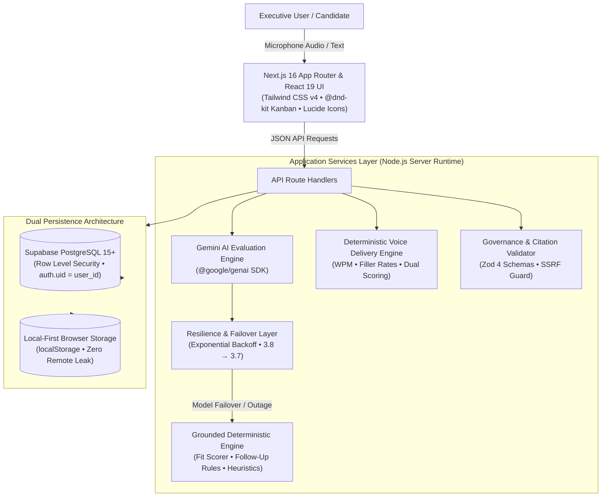

# Career Command Center

<p align="center">
  
</p>

<p align="center">
  <strong>Career Command Center</strong> is an AI-native career operating system that combines opportunity intelligence, professional network analysis, interview preparation, workflow automation, and voice delivery performance analytics in one integrated platform.
</p>

<p align="center">
  <a href="https://career-command-center-gamma.vercel.app"><strong>Live Production Application</strong></a> •
  <a href="#product-architecture"><strong>Architecture</strong></a> •
  <a href="#engineering-approach"><strong>Agentic Engineering</strong></a> •
  <a href="#quality-and-testing"><strong>Quality Gates</strong></a>
</p>

<p align="center">
  
  
  
  
  
  
  
</p>

---

## 🧭 Why I Built It

Senior strategic professionals—such as AI Strategy leads, GTM & Revenue Operations directors, Chiefs of Staff, and business transformation operators—possess complex, non-linear career achievements. Their professional value is defined by matrixed leadership, cross-functional influence, indirect ownership, and quantified commercial outcomes.

Traditional career management for executive roles is deeply fragmented across:
- **Job boards & ATS portals** that reduce senior achievement to keyword-matching.
- **Spreadsheets & personal CRM notes** that quickly desynchronize from active hiring timelines.
- **Disconnected networking tools** that lack contextual alignment to target employer openings.
- **Static interview documents** that fail to prepare candidates for rigorous executive probing.
- **Ad-hoc generative AI chats** that produce ungrounded, generic narratives that collapse under executive scrutiny.

**Career Command Center** explores what happens when these fragmented touchpoints are treated as a unified, evidence-governed operating system rather than disconnected tasks.

---

## ⚡ What It Does

### 1. Opportunity Intelligence
- **Evidence-Based Fit Evaluation**: Analyzes job opportunities against structured, verified candidate career evidence records with stable citation IDs.
- **Two-Step Evaluation Pipeline**: Freezes requirement extraction prior to candidate matching, eliminating confirmation bias.
- **Prioritization & Recommendations**: Categorizes alignment into actionable next steps (`Apply`, `Network First`, `Monitor`, `Deprioritize`) with gap identification and mitigation framing.
- **Pipeline Management**: Kanban CRM and tabular CRM views with stage progression, custom search, and horizontal viewport navigation.

### 2. Network Intelligence
- **Relationship Directory**: Ingests, deduplicates, and manages professional network datasets.
- **Company Mapping**: Automatically surfaces warm connection paths at target employers during role evaluation and interview preparation.
- **Actionable Linking**: Associates specific network contacts directly with scheduled interviews and outreach tasks.

### 3. Interview Intelligence & War Room
- **Executive Role Briefing**: Generates strategic hiring mandate briefs aligned directly to verified candidate narrative.
- **Executive Readiness Score (0–100)**: Multi-dimensional index evaluating role understanding, positioning, story bank preparation, gap mitigation, company knowledge, and question readiness.
- **Grounded STAR Story Bank**: Automatically maps verified career achievements to anticipated competency, leadership, and operational questions.
- **Defensive Gap Mitigation**: Formulates grounded bridges addressing identified domain or experience gaps.
- **Executive Cheat Sheet**: One-click printable executive briefing (Markdown and Print/PDF export).

### 4. Voice Interview Intelligence & Speech Delivery Metrics (v3.4)
- **Answer Mode Flexibility (`[ Type ] [ Speak ]`)**: Practice via keyboard or natural voice capture using browser microphone input.
- **Real-Time Speech-to-Text Preview**: Dynamic live transcription with a canonical editable transcript buffer for review before evaluation.
- **Observable Speech Delivery Metrics**:
  - *Words Per Minute (WPM)*: Pacing evaluation against executive speaking reference bands (130–165 WPM).
  - *Filler-Word Analysis*: Conservative detection of common fillers (`um`, `uh`, `basically`, `like`, `you know`) with rate-per-minute calculations.
  - *Pause Analysis*: Measurable silence interval calculation without fabricating unobservable values.
  - *Verbosity & Concision*: Response length classification (`too_brief`, `appropriate`, `potentially_overlong`).
- **Dual Scorecards & Question-Aware Weighting**:
  - *Content Score* (6 dimensions: Relevance, Evidence Specificity, Strategic Depth, Executive Comms, Structure, Concision).
  - *Delivery Score* (6 dimensions: Pace, Verbal Concision, Filler Control, Pausing, Clarity, Executive Delivery).
  - *Question-Aware Weighting*: Behavioral (75/25), Strategic (70/30), Culture/Pitch (60/40), Text Mode (100/0).
- **Interviewer Personas**: Recruiter, Hiring Manager, Executive / VP, Behavioral Coach, and Peer / Tech Lead (~33% shared anchor questions, ~67% persona-specific questions).
- **Adaptive Live Simulation (Preview)**: Server-mediated conversational interview mode that evaluates candidate responses and dynamically generates contextual follow-up probes targeting metrics, personal ownership, strategic trade-offs, and stakeholder alignment.

### 5. Workflow Automation
- **Forward-Only Activity Timeline**: Chronological tracking of recruiter calls, screenings, interviews, thank-you notes, offers, and decisions.
- **Deterministic Smart Follow-Up Engine**: Urgency recommendations governed by deterministic rules (overdue follow-up dates, post-interview thank-yous, application silence, recruiter silence, referral nudges).
- **AI Follow-Up Drafter**: Drafts executive follow-up communications across Professional, Warm, and Assertive tones.
- **Human-in-the-Loop Safeguard**: Zero automated email or LinkedIn sending; all outreach is user-reviewed, copied, and recorded.

### 6. Performance Analytics
- **Historical Session Trends**: Multi-session tracking of Content Scores, Delivery Scores, and Overall Performance over time.
- **Two-Session Comparative Analysis**: Side-by-side session comparison displaying metric deltas across delivery pacing, filler rates, and dimension scores.

---

## 🏗️ Product Architecture

Career Command Center utilizes a modern, resilient full-stack architecture built on Next.js 16 and Supabase PostgreSQL.



### Technology Stack

| Layer | Technologies |
|---|---|
| **Framework** | Next.js 16.2 (App Router & Turbopack), React 19, TypeScript (Strict Mode) |
| **Styling & UI** | Tailwind CSS v4, `@dnd-kit/core`, `@dnd-kit/sortable`, accessible ARIA patterns |
| **AI Intelligence** | Google Gemini 3.8 Flash (Primary) & Gemini 3.7 Flash (Failover) via official `@google/genai` SDK |
| **Grounding & Web** | Google Search Grounding (`googleSearch`), SSRF-protected URL verification |
| **Database & Auth** | Supabase PostgreSQL 15+, Supabase Auth SSR (`@supabase/ssr`), strict Row Level Security (RLS) |
| **Testing & QA** | Vitest 4, Playwright 1.62, ESLint 9, custom verification harness |
| **Deployment** | Vercel (Edge network & automated branch preview deployments) |

---

## 🛡️ AI Reliability Architecture

In production AI systems, probabilistic models must not introduce single points of failure. Career Command Center implements a 3-tier resilient routing topology:

```
Tier 1: Google Gemini 3.8 Flash (Primary Intelligence)
   ↓ (transient error / 429 / 503 / timeout — bounded retries with jitter)
Tier 2: Google Gemini 3.7 Flash (Automated Failover)
   ↓ (dual model outage / quota exhaustion / network failure)
Tier 3: Grounded Deterministic Engine (Offline Rule-Based Evaluation)
```

- **Deterministic Fallback**: If cloud AI APIs are unavailable, the application gracefully activates its built-in deterministic heuristic engines. Fit evaluations, executive brief outlines, question banks, and follow-up urgencies continue to function without crashing or losing user work.
- **Transparent Execution Disclosure**: The user interface transparently discloses the active execution tier (`Live AI Coaching`, `AI Fallback Coaching`, or `Simplified Interview Coaching`).
- **Zero Secret Leakage**: All provider errors, raw quota responses, and internal stack traces are sanitized before returning to client components.

---

## 🔒 Voice Privacy & Ephemeral Audio

Career Command Center treats microphone audio as confidential, highly sensitive biometric data:

1. **In-Memory Ephemeral Audio**: Microphone recordings are processed strictly in-memory in the browser. Raw audio blobs are **never** persisted to Supabase, browser `localStorage`, Vercel servers, or application logs.
2. **Deterministic Lifecycle Cleanup**: When an answer is evaluated, reset, retried, or the user navigates tabs, object URLs are immediately revoked and audio elements are halted.
3. **Canonical Buffer Governance**: Only the candidate's reviewed and confirmed transcript text is transmitted to evaluation endpoints.
4. **Third-Party Processing Disclosure**: Speech-to-text preview utilizes the browser's native Web Speech API; speech transcription handling is governed by the user's browser vendor and operating system policies.

---

## 🧪 Demo Data & Candidate Isolation

To ensure security for public portfolio viewing:

- **Public Demo Isolation**: Unauthenticated visitors explore a fully functional, self-contained synthetic executive profile (**Alex Vance**, VP of Operations & Strategy). All modifications remain in isolated browser `localStorage`.
- **Authenticated Cloud Workspaces**: Users who sign in through Supabase Auth enter isolated multi-tenant workspaces where all database rows are partitioned and protected by PostgreSQL Row Level Security (`auth.uid() = user_id`).
- **Synthetic Test Benchmarks**: System benchmarks and end-to-end tests run against synthetic candidate records and curated sample opportunities.

---

## 🤖 Engineering Approach

Career Command Center was independently designed and developed using an **AI-assisted / agentic software development workflow**:

- **System Ownership & Direction**: Product strategy, technical architecture, schema modeling, UX decisions, acceptance criteria, governance rules, and release gates were established and governed by the project owner.
- **Agentic Implementation**: Advanced coding agents (**Google Antigravity** and **Gemini**) were utilized as force multipliers to accelerate implementation, write regression suites, perform code refactoring, investigate edge cases, and execute rigorous release checks.
- **Tight Test Loops**: Every feature was developed against automated unit tests, verification harnesses, and end-to-end Playwright tests before promotion.
- **Disciplined Release Management**: Changes followed structured release preparation passes, human acceptance reviews, and controlled branch promotion to production.

---

## 📊 Quality Gates & Test Coverage

All releases must pass strict, non-negotiable automated quality gates before deployment:

| Suite | Tests | Scope | Status |
|---|---|---|---|
| **Vitest Unit & Contract Tests** | **411** tests across 43 suites | Delivery metrics, scoring independence, candidate isolation, RLS rules, Gemini resilience, deduplication | **PASSED** |
| **V3.4 Master Verification Harness** | **43** checks | Deterministic speech math, filler detection, pause rules, dual scorecards, persona sets, privacy invariants | **PASSED** |
| **Playwright End-to-End Tests** | **36** tests across 7 specs | Full lifecycle, kanban CRM, table chevrons, voice answer recording, performance analytics, cloud migration | **PASSED** |
| **TypeScript Strict Validation** | Full codebase | Strict type checking (`npx tsc --noEmit`) | **0 errors** |
| **ESLint Static Analysis** | Full codebase | React 19 hook purity and lint checks (`npm run lint`) | **0 errors** |
| **Production Build** | Full codebase | Next.js 16.2 Turbopack optimized production compilation | **PASSED** |

---

## 📸 Interface Surfaces

| Surface | Description |
|---|---|
| **Dashboard** | Executive opportunity summary, high-priority role cards, tactical momentum, and Next Best Career Action. |
| **Opportunities Pipeline** | Customizable Kanban CRM and Tabular CRM with horizontal viewport navigation chevrons and stage filtering. |
| **Opportunity Intelligence** | 18-section role fit analysis, qualification citation breakdown, objection mitigation, and question banks. |
| **Interview War Room** | Executive role brief, readiness score index, mapped STAR story bank, defensive positioning, and cheat sheet. |
| **Voice Interview Coaching** | Interactive mock interview simulator with browser voice recording, delivery pacing, filler counts, and dual scorecards. |
| **Performance Analytics** | Historical score trend visualization and side-by-side two-session comparison with metric deltas. |

> *Self-guided walkthrough: Visit the [Live Production Demo](https://career-command-center-gamma.vercel.app) to explore the interface directly with pre-loaded synthetic data.*

---

## 🚀 Current Release: v3.4.0

### Highlights
- **Voice Interview Intelligence**: In-browser speech capture with live transcript preview and canonical text buffers.
- **Speech Delivery Analytics**: Observable WPM pacing, conservative filler word analysis, and pause duration measurement.
- **Dual Scorecards**: Separate 6-dimension Content and 6-dimension Delivery scorecards with question-aware weighting.
- **Interviewer Personas**: 5 distinct personas (Recruiter, Hiring Manager, Executive/VP, Behavioral Coach, Peer/Tech Lead) with tailored question banks.
- **Adaptive Live Simulation**: Conversational turn-taking mode with contextual follow-up probing.
- **Runtime Gemini 3.8 Flash**: Upgraded runtime model routing to Gemini 3.8 Flash primary with resilient Gemini 3.7 Flash failover.
- **Pipeline Navigation**: Added horizontal scroll controls and edge chevrons to the Opportunities Pipeline table.

---

## 🗺️ Product Roadmap

- **Expanded Interview Personas**: Custom user-defined persona profiles with uploaded interviewer background context.
- **Calendar & Touchpoint Synchronization**: Direct synchronization with Google Calendar and Outlook for scheduled interview milestones.
- **Multimodal Presentation Coaching**: Slide-deck walkthrough mode evaluating candidate delivery during executive presentations.
- **Expanded Agentic Workflows**: Context-aware preparation briefings triggered automatically upon calendar interview detection.

---

## 👤 About the Builder

**Tanaka Chikosi** is an AI strategy and operations leader focused on enterprise AI adoption, AI-enabled operating models, GTM strategy, and practical agentic workflows.

- **GitHub**: [@tichikosi](https://github.com/tichikosi)
- **Project Repository**: [career-command-center](https://github.com/tichikosi/career-command-center)

---

## 📜 Disclaimer

Career Command Center is an independently developed software project created for portfolio demonstration and executive career intelligence workflows. It is not affiliated with, endorsed by, or sponsored by Google or any other company. All demo data, candidate profiles (Alex Vance), and sample opportunity postings are synthetic.
